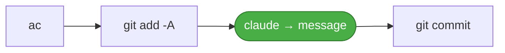
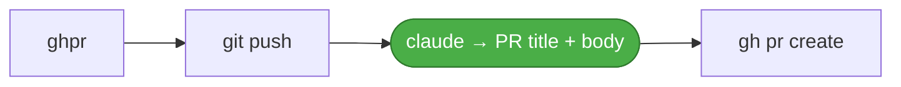

# fish-ai-git

[](https://github.com/Guernik/fish-ai-git/actions/workflows/ci.yml)
[](LICENSE)
[](https://fishshell.com/)

A small, focused set of [fish](https://fishshell.com/) functions for an
AI-assisted git workflow. Stage-and-commit with an AI-written
[Conventional Commit](https://www.conventionalcommits.org/) message, open a
GitHub PR with an AI-written title and body, and a couple of git shortcuts to
round out the loop.

The AI functions call the [Claude Code CLI](https://claude.com/claude-code)
(`claude`), so the diff never leaves your machine except through your own
Claude account.

**1. Auto commit** and **GH PR**

https://github.com/user-attachments/assets/4e26e62b-01b6-496c-b92c-aa978dc4f766

**2. Checkout main, pull, and delete merged branch**

https://github.com/user-attachments/assets/958a07ad-5350-4e9c-bd17-80a9a4f8724b

(Warning due to the use of squash merge)

## Installation

### Using [fisher](https://github.com/jorgebucaran/fisher)?

```console
fisher install Guernik/fish-ai-git
```

Update later with `fisher update`.

### Directly from repo

```console
git clone https://github.com/Guernik/fish-ai-git
cd fish-ai-git
just install-dev     # symlinks functions/ and conf.d/ into ~/.config/fish
```

Remove the links with `just uninstall-dev`.

## Functions

| Function | What it does                                                                                                                                                                            |
| -------- | --------------------------------------------------------------------------------------------------------------------------------------------------------------------------------------- |
| `ac`     | Stage **all** changes and commit with an AI-generated Conventional Commit message. Shows the message and asks before committing (`y` to commit, `e` to edit, `n` to abort).             |
| `ghpr`   | Push the current branch and open a GitHub PR with an AI-generated title and body. Detects the base branch automatically; `w` opens the browser pre-filled instead of creating directly. |
| `gitm`   | Switch to the repo's default branch, `pull`, and delete the branch you left (only if it's already merged — unmerged work is never dropped).                                             |
| `gitc`   | Shorthand for `git checkout` (with `git checkout` completions).                                                                                                                         |

### Examples

```console
# On a feature branch, after making changes:
ac
# → Generating commit message…
#   feat(auth): add token refresh
#   …
#   Commit? [Y/n/e(dit)]

ghpr
# → pushes the branch and opens a PR with an AI title + body
#   Push 'feature/foo' and open PR against 'main'? [Y/n/w(eb)]

gitm
# → back on main, pulled, and the merged feature branch cleaned up
```

### How `ac` and `ghpr` work





## Requirements

- fish ≥ 3.6
- [`claude`](https://claude.com/claude-code) — for `ac` and `ghpr`
- [`gh`](https://cli.github.com) — for `ghpr`
- `git`

Each function checks for the tools it needs and prints an install hint if one is
missing.

## Configuration

`ac` and `ghpr` use Claude's `haiku` model by default. On install, the plugin
seeds `AC_MODEL` and `GHPR_MODEL` as universal variables (via Fisher's
[event system](https://github.com/jorgebucaran/fisher#event-system)) — only if
you haven't already set them. Override either at any time:

```console
set -Ux AC_MODEL sonnet
set -Ux GHPR_MODEL sonnet
```

Your override is preserved across `fisher update`, and left untouched on
`fisher remove` (only the untouched `haiku` default is cleaned up). The event
handlers live in [`conf.d/fish-ai-git.fish`](conf.d/fish-ai-git.fish); the
functions also self-default, so they still work if copied out of the plugin.

Both `ac` and `ghpr` exclude noisy generated files (lockfiles, minified assets,
`dist/`, `build/`, snapshots) from the diff sent to the model — **only** from
what the model sees; every staged file is still committed. They also cap the
diff at ~100 KB so a huge change can't blow up the prompt. Edit the `exclude`
list at the top of each function to tune this.

## Development

This repo uses a [`justfile`](justfile):

```console
just            # list recipes
just lint       # syntax + formatting check (fish -n, fish_indent --check)
just fmt        # auto-format every fish file
just test       # run the fishtape suite (mocks claude/gh; real temp git repos)
```

Tests use [fishtape](https://github.com/jorgebucaran/fishtape). Install it once
with fisher (the [documented](https://github.com/jorgebucaran/fishtape) way):

```console
fisher install jorgebucaran/fishtape
```

`just test` then runs the suite. Tests mock the `claude` and `gh` CLIs as PATH
shims and run against throwaway git repos wired to a local bare remote, so they
exercise the real logic (diff filtering, base-branch detection, the confirm/abort
paths) without calling any network service.

Optional [pre-commit](https://pre-commit.com/) hooks run `just lint` on commit
and `just test` on push. With [pre-commit installed](https://pre-commit.com/#install):

```console
just install-hooks
```

## License

[MIT](LICENSE)
